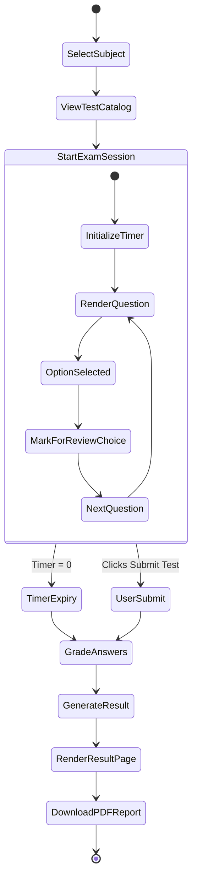

# Activity Diagram

```mermaid
stateDiagram-v2
    [*] --> SelectSubject
    SelectSubject --> ViewTestCatalog
    ViewTestCatalog --> StartExamSession
    
    state StartExamSession {
        [*] --> InitializeTimer
        InitializeTimer --> RenderQuestion
        RenderQuestion --> OptionSelected
        OptionSelected --> MarkForReviewChoice
        MarkForReviewChoice --> NextQuestion
        NextQuestion --> RenderQuestion
    }
    
    StartExamSession --> TimerExpiry : Timer = 0
    StartExamSession --> UserSubmit : Clicks Submit Test
    
    TimerExpiry --> GradeAnswers
    UserSubmit --> GradeAnswers
    
    GradeAnswers --> GenerateResult
    GenerateResult --> RenderResultPage
    RenderResultPage --> DownloadPDFReport
    DownloadPDFReport --> [*]
```
