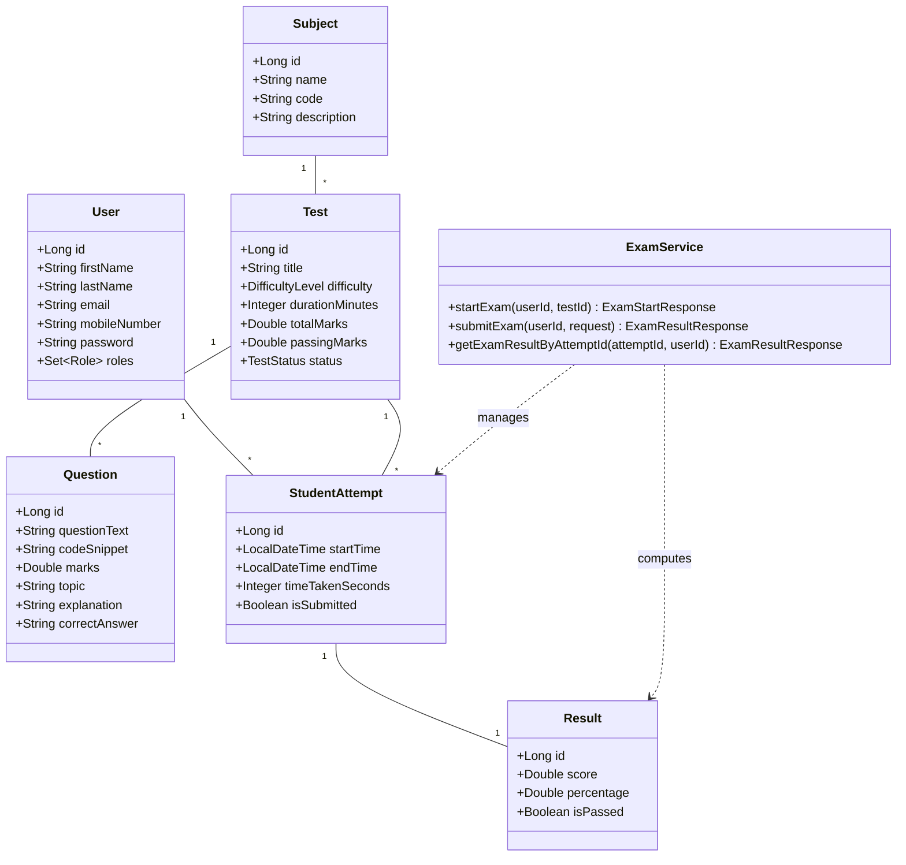

# Class Diagram

```mermaid
classDiagram
    class User {
        +Long id
        +String firstName
        +String lastName
        +String email
        +String mobileNumber
        +String password
        +Set~Role~ roles
    }

    class Subject {
        +Long id
        +String name
        +String code
        +String description
    }

    class Test {
        +Long id
        +String title
        +DifficultyLevel difficulty
        +Integer durationMinutes
        +Double totalMarks
        +Double passingMarks
        +TestStatus status
    }

    class Question {
        +Long id
        +String questionText
        +String codeSnippet
        +Double marks
        +String topic
        +String explanation
        +String correctAnswer
    }

    class StudentAttempt {
        +Long id
        +LocalDateTime startTime
        +LocalDateTime endTime
        +Integer timeTakenSeconds
        +Boolean isSubmitted
    }

    class Result {
        +Long id
        +Double score
        +Double percentage
        +Boolean isPassed
    }

    class ExamService {
        +startExam(userId, testId) ExamStartResponse
        +submitExam(userId, request) ExamResultResponse
        +getExamResultByAttemptId(attemptId, userId) ExamResultResponse
    }

    User "1" -- "*" StudentAttempt
    Subject "1" -- "*" Test
    Test "1" -- "*" Question
    StudentAttempt "1" -- "1" Result
    Test "1" -- "*" StudentAttempt
    ExamService ..> StudentAttempt : manages
    ExamService ..> Result : computes
```
