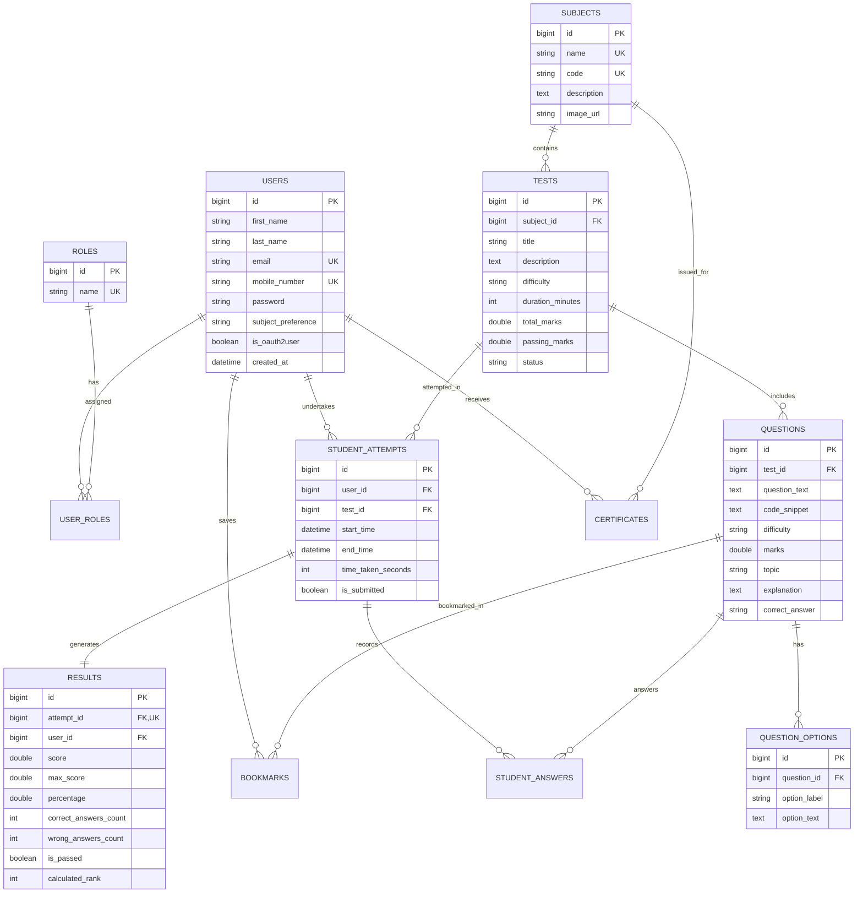

# Entity Relationship (ER) Diagram

```mermaid
erDiagram
    USERS ||--o{ USER_ROLES : has
    ROLES ||--o{ USER_ROLES : assigned
    SUBJECTS ||--o{ TESTS : contains
    TESTS ||--o{ QUESTIONS : includes
    QUESTIONS ||--o{ QUESTION_OPTIONS : has
    USERS ||--o{ STUDENT_ATTEMPTS : undertakes
    TESTS ||--o{ STUDENT_ATTEMPTS : attempted_in
    STUDENT_ATTEMPTS ||--o{ STUDENT_ANSWERS : records
    QUESTIONS ||--o{ STUDENT_ANSWERS : answers
    STUDENT_ATTEMPTS ||--|| RESULTS : generates
    USERS ||--o{ BOOKMARKS : saves
    QUESTIONS ||--o{ BOOKMARKS : bookmarked_in
    USERS ||--o{ CERTIFICATES : receives
    SUBJECTS ||--o{ CERTIFICATES : issued_for

    USERS {
        bigint id PK
        string first_name
        string last_name
        string email UK
        string mobile_number UK
        string password
        string subject_preference
        boolean is_oauth2user
        datetime created_at
    }

    ROLES {
        bigint id PK
        string name UK
    }

    SUBJECTS {
        bigint id PK
        string name UK
        string code UK
        text description
        string image_url
    }

    TESTS {
        bigint id PK
        bigint subject_id FK
        string title
        text description
        string difficulty
        int duration_minutes
        double total_marks
        double passing_marks
        string status
    }

    QUESTIONS {
        bigint id PK
        bigint test_id FK
        text question_text
        text code_snippet
        string difficulty
        double marks
        string topic
        text explanation
        string correct_answer
    }

    QUESTION_OPTIONS {
        bigint id PK
        bigint question_id FK
        string option_label
        text option_text
    }

    STUDENT_ATTEMPTS {
        bigint id PK
        bigint user_id FK
        bigint test_id FK
        datetime start_time
        datetime end_time
        int time_taken_seconds
        boolean is_submitted
    }

    RESULTS {
        bigint id PK
        bigint attempt_id FK,UK
        bigint user_id FK
        double score
        double max_score
        double percentage
        int correct_answers_count
        int wrong_answers_count
        boolean is_passed
        int calculated_rank
    }
```
