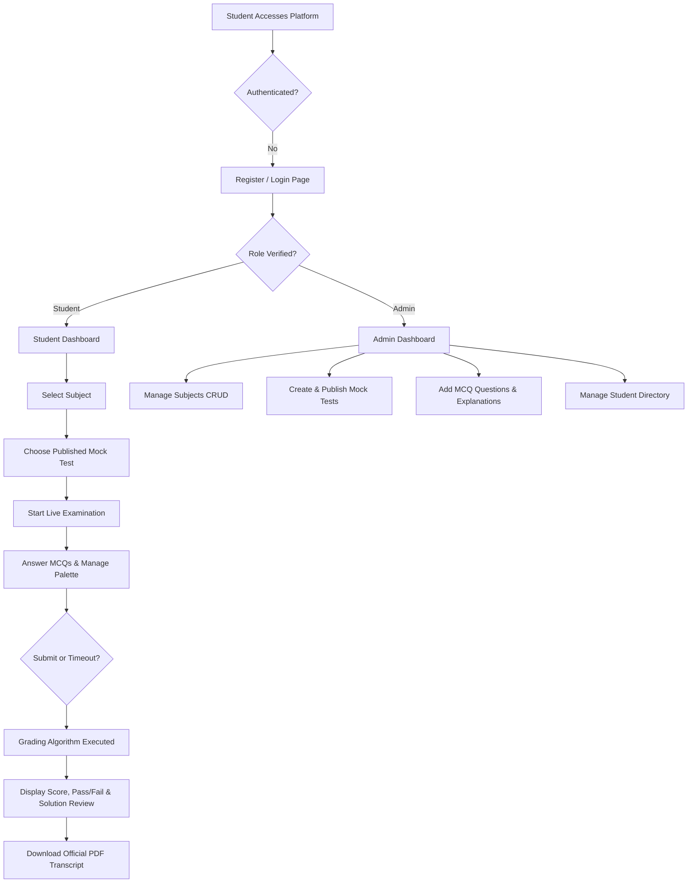

# System Flowchart

```mermaid
flowchart TD
    A[Student Accesses Platform] --> B{Authenticated?}
    B -- No --> C[Register / Login Page]
    C --> D{Role Verified?}
    D -- Student --> E[Student Dashboard]
    D -- Admin --> F[Admin Dashboard]
    
    E --> G[Select Subject]
    G --> H[Choose Published Mock Test]
    H --> I[Start Live Examination]
    I --> J[Answer MCQs & Manage Palette]
    J --> K{Submit or Timeout?}
    K --> L[Grading Algorithm Executed]
    L --> M[Display Score, Pass/Fail & Solution Review]
    M --> N[Download Official PDF Transcript]
    
    F --> O[Manage Subjects CRUD]
    F --> P[Create & Publish Mock Tests]
    F --> Q[Add MCQ Questions & Explanations]
    F --> R[Manage Student Directory]
```
