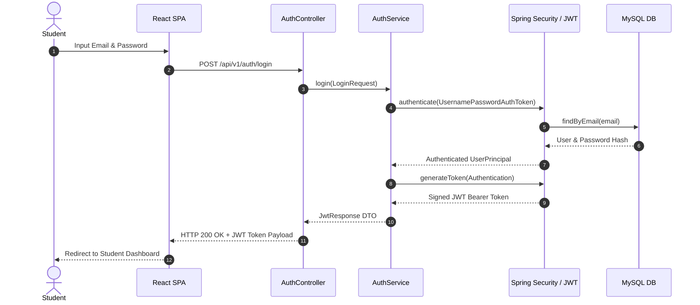
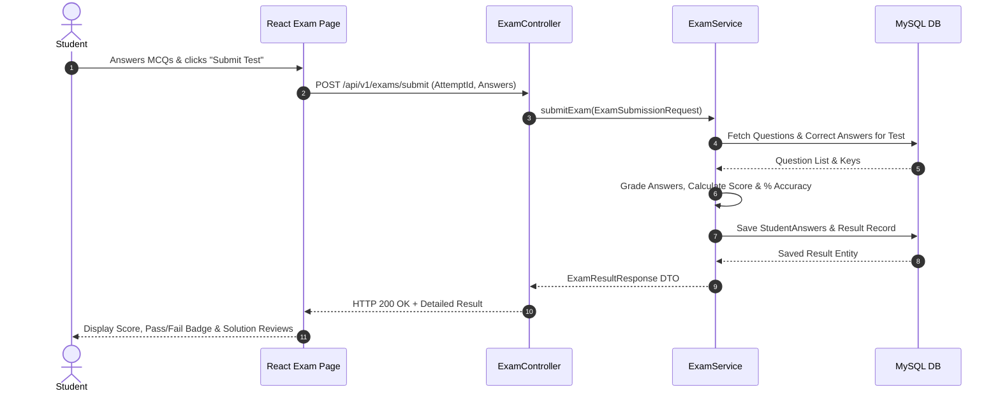

# Sequence Diagram

## 1. Authentication & JWT Token Issuance

```mermaid
sequenceDiagram
    autonumber
    actor Student
    participant React as React SPA
    participant AuthCtrl as AuthController
    participant AuthSvc as AuthService
    participant Sec as Spring Security / JWT
    participant DB as MySQL DB

    Student->>React: Input Email & Password
    React->>AuthCtrl: POST /api/v1/auth/login
    AuthCtrl->>AuthSvc: login(LoginRequest)
    AuthSvc->>Sec: authenticate(UsernamePasswordAuthToken)
    Sec->>DB: findByEmail(email)
    DB-->>Sec: User & Password Hash
    Sec-->>AuthSvc: Authenticated UserPrincipal
    AuthSvc->>Sec: generateToken(Authentication)
    Sec-->>AuthSvc: Signed JWT Bearer Token
    AuthSvc-->>AuthCtrl: JwtResponse DTO
    AuthCtrl-->>React: HTTP 200 OK + JWT Token Payload
    React-->>Student: Redirect to Student Dashboard
```

## 2. Exam Submission & Automated Grading Workflow

```mermaid
sequenceDiagram
    autonumber
    actor Student
    participant React as React Exam Page
    participant ExamCtrl as ExamController
    participant ExamSvc as ExamService
    participant DB as MySQL DB

    Student->>React: Answers MCQs & clicks "Submit Test"
    React->>ExamCtrl: POST /api/v1/exams/submit (AttemptId, Answers)
    ExamCtrl->>ExamSvc: submitExam(ExamSubmissionRequest)
    ExamSvc->>DB: Fetch Questions & Correct Answers for Test
    DB-->>ExamSvc: Question List & Keys
    ExamSvc->>ExamSvc: Grade Answers, Calculate Score & % Accuracy
    ExamSvc->>DB: Save StudentAnswers & Result Record
    DB-->>ExamSvc: Saved Result Entity
    ExamSvc-->>ExamCtrl: ExamResultResponse DTO
    ExamCtrl-->>React: HTTP 200 OK + Detailed Result
    React-->>Student: Display Score, Pass/Fail Badge & Solution Reviews
```
