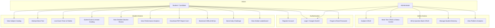

# Use Case Diagram

```mermaid
graph TD
    subgraph Actors
        Student["Student / Candidate"]
        Admin["Administrator"]
    end

    subgraph Authentication
        UC1["Register Account"]
        UC2["Login / Google OAuth2"]
        UC3["Forgot & Reset Password"]
    end

    subgraph Student Actions
        UC4["View Subject Catalog"]
        UC5["Attempt Mock Test"]
        UC6["Live Exam Timer & Palette"]
        UC7["Submit Exam & Instant Grading"]
        UC8["View Detailed Solution Review"]
        UC9["View Performance Analytics"]
        UC10["Download PDF Report Card"]
        UC11["Bookmark Difficult MCQs"]
        UC12["Solve Daily Challenge"]
        UC13["View Global Leaderboard"]
    end

    subgraph Admin Actions
        UC14["Subject CRUD"]
        UC15["Mock Test CRUD & Status Control"]
        UC16["MCQ Question Bank CRUD"]
        UC17["Manage Student Directory"]
        UC18["View Platform Analytics"]
    end

    Student --> UC1
    Student --> UC2
    Student --> UC3
    Student --> UC4
    Student --> UC5
    Student --> UC6
    Student --> UC7
    Student --> UC8
    Student --> UC9
    Student --> UC10
    Student --> UC11
    Student --> UC12
    Student --> UC13

    Admin --> UC2
    Admin --> UC14
    Admin --> UC15
    Admin --> UC16
    Admin --> UC17
    Admin --> UC18
```
